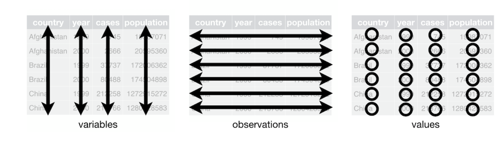
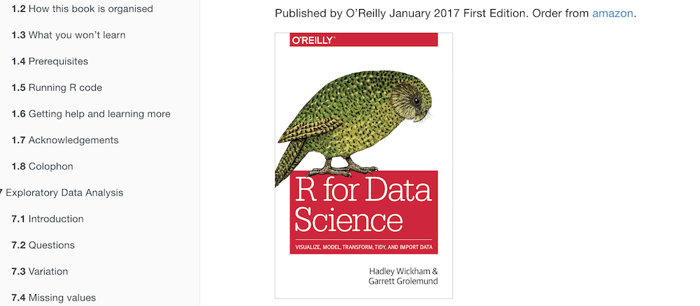

## Course material

This presentation: [http://bit.ly/datavizualisation]()

## What are we talking about? 

- Explore your dataset, **graphically**
- Find relationship between variables
- Find differences between groups

## Loading the libraries 

```{r, warning=F}

library("tidyverse")

```


# Let's talk about your data

## How you data should look like



Figure from http://r4ds.had.co.nz/tidy-data.html

> Following three rules makes a dataset tidy: variables are in columns, observations are in rows, and values are in cells.


## Loading the data


```{r load_libraries, warning=F}
mydata <- read_csv("datasets/architect.csv")

```


## Look at the struture of the data

```{r, warning=F}
str(mydata)
```


## Filter by row

Use `dplyr` to filter data based on specific values. `%>%` is called a *pipe* and allows you to queue up operations. 

```{r, warning=F}
mydata %>%
  filter(genotype == "dense") %>%
  head()

```


## Select by columns

You can also select, or drop specific columns using the `select` verb.

```{r, warning=F}

mydata %>%
  select(c(FileName, genotype, Time, Height, Width))%>%
  head()


```

## Select by columns

You can also select, or drop specific columns using the `select` verb.

```{r, warning=F}

mydata <- mydata %>%
  select(-c(X1))

mydata %>%
  head()

```


## Create new variables

And you can create new variables using the `mutate` verb. 

```{r, warning=F}

mydata %>%
  mutate(newvar = log(TRL))%>%
  select(c(genotype, Time, newvar)) %>%
  head()

```

## More about data manipulation:

http://r4ds.had.co.nz




# Let's have a look at the data


## What is `ggplot` ?

Used to produce statistical graphics, main developer = Hadley Wickham 

> attempt to take the good things about base and lattice graphics and improve on them with a strong, underlying model "
  
based on The Grammar of Graphics by Leland Wilkinson, 2005

> describes the meaning of what we do when we construct statistical graphics ... More than a taxonomy ... Computational system based on the underlying mathematics of representing statistical functions of data.

- does not limit developer to a set of pre-specified graphics
- adds some concepts to grammar which allow it to work well with R


## `ggplot` components

- `data`: in ggplot2, data must be stored as an R data frame 
- `coordinate system`: describes 2-D space that data is projected onto 
- `geoms`: describe type of geometric objects that represent data
- `aesthetics`: describe visual characteristics that represent data
- `scales`: for each aesthetic, describe how visual characteristic is converted to display values
- `stats`: describe statistical transformations that typically summarize data
- `facets`: describe how data is split into subsets and displayed as multiple small graphs 


## `data` and `aestetic`

We first create the plot, by setting the `data` and the `aestetic`. 

```{r, echo=T, warning=F}
myplot <- ggplot(data=mydata, aes(x=TRL, y=TNLR))
myplot
```

## Adding a `geometry` - Points

We need to add a *geom* to display the plot. Different *geom* can be used.

```{r, echo=T, warning=F}

myplot + 
  ### <b>
  geom_point()
  ### </b>
```

## Adding a `geometry` - Lines

We need to add a *geom* to display the plot. Different *geom* can be used.

```{r, echo=T, warning=F}
myplot + 
  ### <b>
  geom_line()
  ### </b>
```

## Adding a `geometry` - steps

We need to add a *geom* to display the plot. Different *geom* can be used.

```{r, echo=T, warning=F}
myplot + 
  ### <b>
  geom_step()
  ### </b>

```


## Combining `geoms`

The advantage of using a `layered` approach, is that the layers can be combined. For instance, several `geom` can be used in the same plot.

```{r, echo=T, warning=F}
myplot + 
  ### <b>
  geom_point() + geom_step()
  ### </b>
```


## Using **discrete** categories

Let's use the different categories we have. For this, we add a `colour` argument in the `aes`. `ggplot` will automatically pick a discrete color scale.

```{r, echo=T, warning=F}

ggplot(data=mydata, aes(x=TRL, y=TNLR, colour=genotype)) +
  geom_point()

```


## Using **continuous** categories

Let's use one of the variable as a continuous caterogy. For this, we add a `colour` argument in the `aes`. `ggplot` will automatically pick a continuous color scale.

```{r, echo=T, warning=F}

ggplot(data=mydata, aes(x=TRL, y=TNLR, colour=Height)) +
  geom_point()

```


## Using two categories

When using multiple categories, we can both use define different colors (`colour`) and point styles (`shape`) in the `aes` argument.

```{r, echo=T, warning=F}

ggplot(data=mydata, aes(x=TRL, y=TNLR, colour=Time, shape=genotype)) +
  geom_point()

```


## Removing chart junk


```{r, echo=T, warning=F}

ggplot(data=mydata, aes(x=TRL, y=TNLR, colour=Time, shape=genotype)) +
  geom_point() + 
  theme_classic()

```

## Using `facets`

`Facets` can be used to split the data and present them side to side. 

```{r, echo=T, warning=F}

ggplot(data=mydata, aes(x=TRL, y=TNLR, colour=genotype)) +
  geom_point() + 
  facet_wrap(~ genotype)

```


## Adding `stats` tot the plots

`ggplot` has some built-in `stat` functions that can be directly used in the plots.

```{r, echo=T, warning=F}


ggplot(data=mydata, aes(x=TRL, y=TNLR, colour=genotype)) + 
  geom_point() + 
  geom_smooth()

```


## Adding `stats` tot the plots

`ggplot` has some built-in `stat` functions that can be directly used in the plots.
 
```{r, echo=T, warning=F, message=F}
ggplot(data=mydata, aes(x=TRL, y=TNLR, colour=genotype)) + 
  geom_point() + 
  geom_smooth(se = FALSE)

```


## Adding `stats` tot the plots

`ggplot` has some built-in `stat` functions that can be directly used in the plots.

```{r, echo=T, warning=F, message=F}
ggplot(data=mydata, aes(x=TRL, y=TNLR, colour=genotype)) + 
  geom_point() + 
  geom_smooth(se = FALSE, method="lm")

```

## Adding `stats` tot the plots

`ggplot` has some built-in `stat` functions that can be directly used in the plots.

```{r, echo=T, warning=F}
ggplot(data=mydata, aes(x=TRL, y=TNLR, colour=genotype)) + 
  geom_point() + 
  stat_ellipse()

```

## Boxplot

```{r, echo=T, warning=F}

ggplot(data=mydata, aes(x=genotype, y=TRL)) + 
  geom_boxplot()

```


## View everything at once

Now, can also try to see the data at once. For this, we need to play a bit with the initial data, to move from a `wide` to `long` format. 

```{r, echo=T, warning=F}

mydatalong <- mydata %>%
  gather(TRL:ExtPathLength, key = "variable", value = "value")

mydatalong %>%
  head()


```


## View everything at once

```{r, echo=T, eval=F, warning=F}

# Make a lin plot, for each variable
mydatalong %>%
  filter(Time == max(Time)) %>%   # Select just one time point (the last)
  ggplot(aes(genotype, value, colour=genotype)) + 
  geom_boxplot() + 
  facet_wrap(~variable, nrow=2)+ 
  theme(text = element_text(size=9))
```

## View everything at once

```{r, echo=F, eval=T, warning=F, out.width = '100%'}

# Make a lin plot, for each variable
mydatalong %>%
  filter(Time == max(Time)) %>%   # Select just one time point (the last)
  ggplot(aes(genotype, value, colour=genotype)) + 
  geom_boxplot() + 
  facet_wrap(~variable, nrow=2)+ 
  theme(text = element_text(size=9))
```


## View everything at once

```{r, echo=T, eval=F, warning=F}

# Make a lin plot, for each variable
mydatalong %>%
  filter(Time == max(Time)) %>%   # Select just one time point (the last)
  ggplot(aes(genotype, value, colour=genotype)) + 
  geom_boxplot() + 
  facet_wrap(~variable, nrow=2, scales = "free")+ 
  theme(text = element_text(size=9))


```

## View everything at once

```{r, echo=F, eval=T, warning=F, out.width = '100%'}

mydatalong %>%
  filter(Time == max(Time)) %>%   # Select just one time point (the last)
  ggplot(aes(genotype, value, colour=genotype)) + 
  geom_boxplot() + 
  facet_wrap(~variable, nrow=2, scales = "free")+ 
  theme(text = element_text(size=9))


```


# Interact with your data

## Using the `plotly` library

> Plotly creates leading open source tools for composing, editing, and sharing interactive data visualization via the Web.

https://plot.ly/


```{r, warning=F, message=F}
library("plotly")
```


## `plotly` works great with `ggplot`

Any type of `ggplot` can be wrapped up in a `plotly` figure

```{r, warning=F, message=F}


pl <- ggplot(data=mydata, aes(x=TRL, y=TNLR, colour=genotype)) +
  geom_point()

ggplotly(pl)

```

## `plotly` works great with `ggplot`

We can choose what type of label we want to see
```{r, warning=F, message=F}


pl <- ggplot(data=mydata, aes(x=TRL, y=TNLR, colour=genotype, label=FileName)) +
  geom_point()

ggplotly(pl)

```


## `plotly` works great with `ggplot`

```{r, warning=F, message=F}


pl <- mydata %>%
  filter(Time == max(Time)) %>%
  ggplot(aes(x=genotype, y=TRL, label=FileName)) +
  geom_boxplot()

ggplotly(pl )

```


## More info

> Google is your friend !

This presentation: [http://bit.ly/datavizualisation]()

[http://seananderson.ca/ggplot2-FISH554/]()

[http://blog.echen.me/2012/01/17/quick-introduction-to-ggplot2/]()

[http://tutorials.iq.harvard.edu/R/Rgraphics/Rgraphics.html]()

[http://zevross.com/blog/2014/08/04/beautiful-plotting-in-r-a-ggplot2-cheatsheet-3]()

